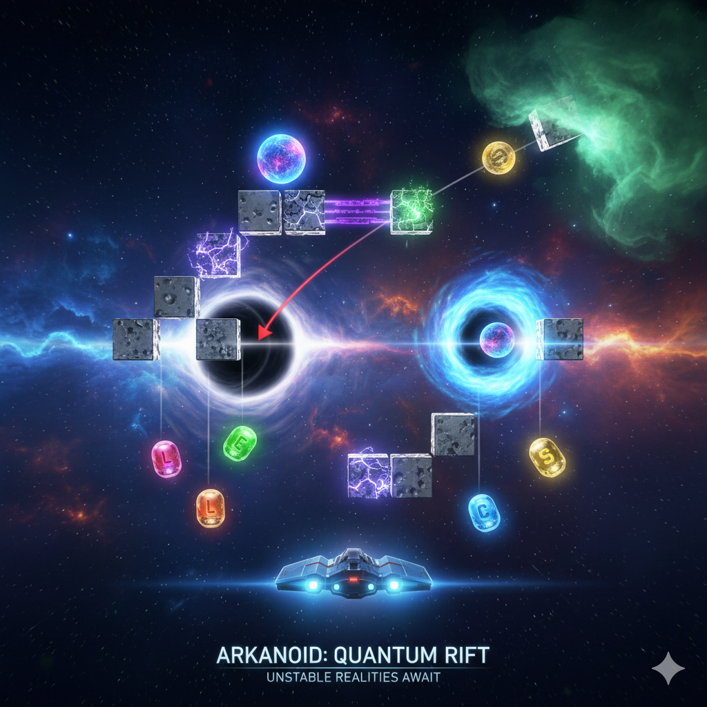

# Arkanoid Game - Object-Oriented Programming Project

## Author
Group 14 - Class INT2204 5
1. Nguyễn Văn Mạnh - 24020221
2. Lê Xuân Phúc - 24020275
3. Hoàng Đức Lâm - 24020194
4. Đỗ Ngọc Sơn - 24020293

**Instructor**: Kiều Văn Tuyên
**Semester**: HK1 - 2025

---

## Description
This is a classic Arkanoid game developed in Java as a final project for Object-Oriented Programming course. The project demonstrates the implementation of OOP principles and design patterns.

**Key features:**
1. The game is developed using Java 17+ with JavaFX/Swing for GUI.
2. Implements core OOP principles: Encapsulation, Inheritance, Polymorphism, and Abstraction.
3. Applies multiple design patterns: Singleton, Factory Method, Strategy, Observer, and State.
4. Features multithreading for smooth gameplay and responsive UI.
5. Includes sound effects, animations, and power-up systems.
6. Supports save/load game functionality and leaderboard system.

**Game mechanics:**
- Control a paddle to bounce a ball and destroy bricks
- Collect power-ups for special abilities
- Progress through multiple levels with increasing difficulty
- Score points and compete on the leaderboard

---

## UML Diagram

### Class Diagram

---

## Design Patterns Implementation

### 1. Singleton Pattern
**Used in:** `GamePane`, `AudioManager`

**Purpose:** Ensure only one instance exists throughout the application.

### 2. Strategy
**Used in:** `Brick`

**Purpose:** To control the behavior of different types of bricks.

---

## Multithreading Implementation

The game uses multiple threads to ensure smooth performance:

1. **Game Loop Thread**: Updates game logic
2. **Rendering Thread**: Handles graphics rendering (EDT for JavaFX Application Thread)
3. **Audio Thread Pool**: Plays sound effects asynchronously
4. **I/O Thread**: Handles save/load operations without blocking UI

---

## Installation

1. Clone the project from the repository.
2. Open the project in the IDE.
3. Run the project.

## Usage

### Controls
| Key | Action |
|-----|--------|
| `←` or `A` | Move paddle left |
| `→` or `D` | Move paddle right |
| `SPACE` | Launch ball / Shoot laser |
| `P` or `ESC` | Pause game |
| `R` | Restart game |

### How to Play
1. **Start the game**: Click "Start" from the main menu.
2. **Control the paddle**: Use arrow keys or A/D to move left and right.
3. **Launch the ball**: Press SPACE to launch the ball from the paddle.
4. **Destroy bricks**: Bounce the ball to hit and destroy bricks.
5. **Collect power-ups**: Catch falling power-ups for special abilities.
6. **Avoid losing the ball**: Keep the ball from falling below the paddle.
7. **Complete the level**: Destroy all destructible bricks to advance.
8. **Customize**: Change the paddle and ball skin with the button in the corner.
9. **Extra challenge**: Change the difficulty to normal or hard to see how far you can go!

### Power-ups
| Icon | Name | Effect |
|------|------|--------|
|  | Double Paddle | Increases paddle width for 10 seconds |
|  | Laser Paddle | Decreases paddle width for 10 seconds |
|  | Multi Ball | Increases ball count by 2 |
|  | Forcefield | Prevent you from losing a bal one time |

### Scoring System
- Normal Brick: 10 points
- Hard Brick: 25 points
- Explosive Brick: 10 + 3x3 area bricks
- Power-up Brick: 30 points

---

## Demo

### Screenshots

**Main Menu**

**Gameplay**

**Power-ups in Action**

**Leaderboard**

### Video Demo

---

## Future Improvements

### Planned Features
1. **Additional game modes**
   - Time attack mode
   - Co-op multiplayer mode

2. **Enhanced gameplay**
   - Boss battles with paddle AI
   - More power-up varieties
   - Achievements system
   - PowerUp system after every level

3. **Technical improvements**
   - Migrate to LibGDX or JavaFX for better graphics
   - Add particle effects and advanced animations
   - Implement AI opponent mode

---

## Technologies Used

| Technology | Version | Purpose |
|------------|---------|---------|
| Java | 17+ | Core language |
| JavaFX | 19.0.2 | GUI framework |
| Maven | 3.9+ | Build tool |
| Jackson | 2.15.0 | JSON processing |

---

## License

This project is developed for educational purposes only.

**Academic Integrity:** This code is provided as a reference. Please follow your institution's academic integrity policies.

---

## Notes

- The game was developed as part of the Object-Oriented Programming with Java course curriculum.
- All code is written by group members with guidance from the instructor.
- Some assets (images, sounds) may be used for educational purposes under fair use.
- The project demonstrates practical application of OOP concepts and design patterns.

---

*Last updated: [12/11/2025]*
